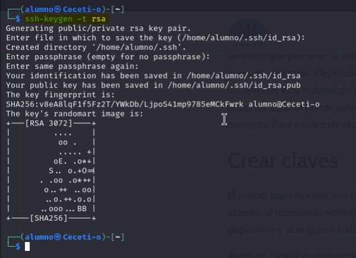
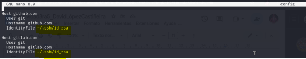
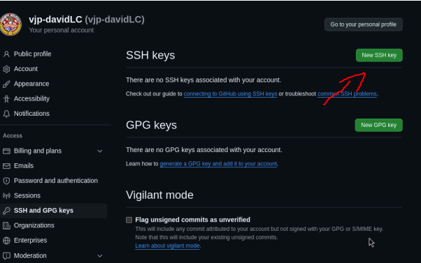
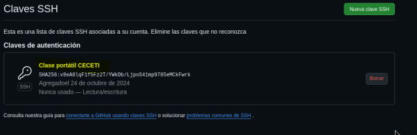

Configuración de GitHub para tener conexión entre la máquina y el repositorio creado.

1º Paso
Creamos clave pública y privada para conectarnos al repositorio remoto en nuestro equipo.

Configuramos ssh.

Dentro de ~/.ssh/config

2º Paso
Luego nos vamos a la configuración de nuestro perfil en github y hacemos lo siguiente:

En el apartado de SSH and GPG keys.

Y añadimos nuestra clave pública.

Una vez hecho ya el enlace de ssh creamos un repositorio en github.

